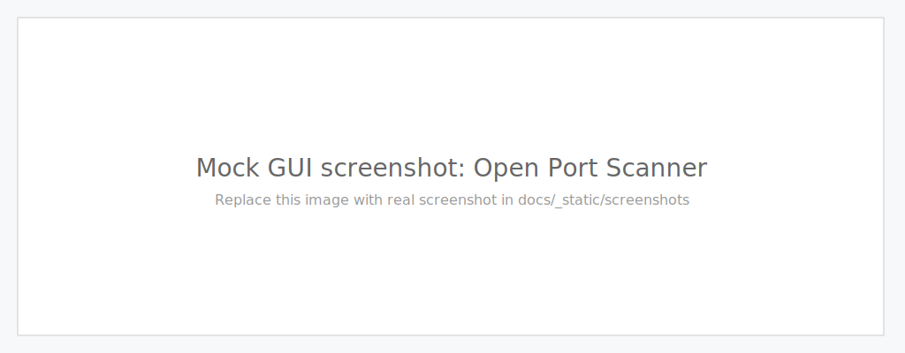
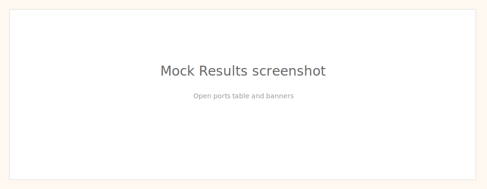

Screenshots
===========

Below are example screenshots to help you use the application. Replace the example images with real screenshots where useful.

GUI – Main Window
------------------

Example – Scan Results
----------------------

Tips
----
* Use `Delay` to reduce confounding effects from lost packets or rate limiting. 1–10 ms is typical for local networks, 10–200 ms on WANs.
* Use `Host Discovery` before scanning large ranges to focus on live hosts.

Adding your own screenshots
---------------------------

If you want to replace the example screenshots with actual captures from your GUI, follow these steps:

1. Capture the screenshot (recommended PNG or SVG), size around 1024x400 for landscape.
2. Place the image in `docs/_static/screenshots/`.
3. Commit the file and re-run `make html` inside `docs/`.

